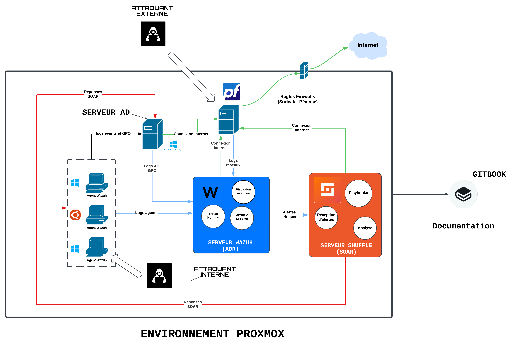
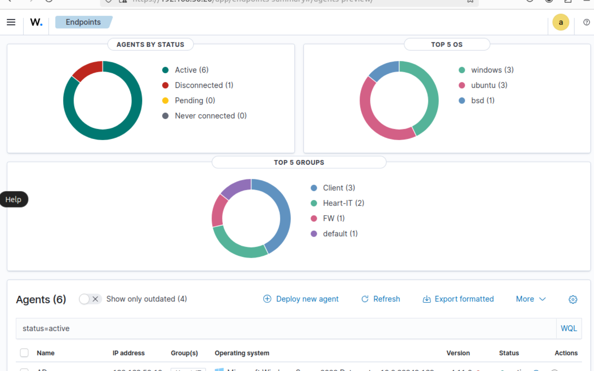
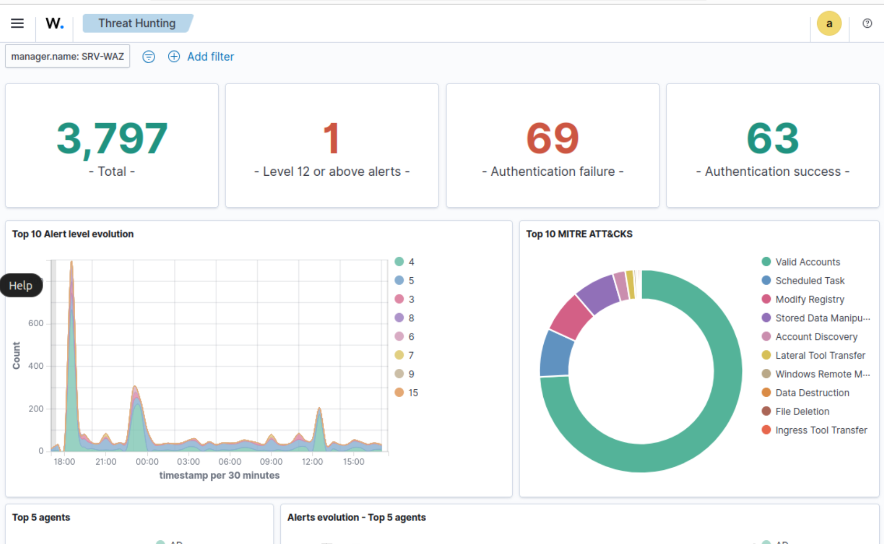

# 🛡️ Mise en place d’un SOC Open Source complet et fonctionnel

## 📌 Introduction
Ce projet vise à mettre en place un **SOC (Security Operations Center)** à l'aide d'outils **open source** tels que **Wazuh (SIEM), Shuffle (SOAR)**, **Suricata (IDS/IPS sur Pfsense)** et **Kibana (Monitoring)**. L’objectif est de **centraliser les logs, détecter les menaces, automatiser les réponses aux incidents et améliorer la gestion de la cybersécurité**.

## 🚀 Objectifs du Projet
- **Déploiement d’un SOC complet et fonctionnel** avec des outils open source.
- **Détection avancée des menaces** en centralisant les logs et en corrélant les événements.
- **Automatisation des réponses aux incidents** grâce à SOAR.
- **Amélioration de la sécurité périmétrique** via un firewall avec IDS/IPS.

## 🏗️ Infrastructure Utilisée
### 🔹 Environnement de Virtualisation : **Proxmox**
### 🔹 Composants du SOC :
- **Wazuh (SIEM)** – Collecte et analyse des logs
- **Shuffle (SOAR)** – Automatisation des incidents
- **Pfsense + Suricata (Firewall/IPS)** – Protection du réseau
- **Active Directory (AD)** – Logs d’authentification
- **Kibana** – Monitoring (intégré à Wazuh)
- **Windows & Linux (Endpoints)** – Journaux d’audit de sécurité

## 📊 Architecture Technique

### 🔸 Schéma global du SOC

## 🔍 Visualisation & Analyse

### 🔸 Agents connectés à Wazuh

### 🔸 Détection de vulnérabilités dans Wazuh
.png)

### 🔸 Tableau de bord Kibana intégré à Wazuh

### 🔸 Logs IDS/IPS via Pfsense + Suricata
.png)

### 🔸 Interface de Shuffle (SOAR)
.png)

### 🔸 Exemple de playbooks d’automatisation dans Shuffle
.png)

### 🔸 Suivi des incidents détectés (Backlog Wazuh)
.png)

## 🛠️ Implémentation

### 🔹 Principales Étapes
1. 📌 Définition du périmètre et choix des outils
2. 📌 Installation des serveurs (Proxmox, Wazuh, Shuffle, Pfsense, Suricata, AD)
3. 📌 Installation des endpoints (WIN10, 11, Ubuntu)
4. 📌 Configuration des agents et intégration dans Wazuh
5. 📌 Définition des règles de détection (corrélation via MITRE ATT&CK)
6. 📌 Création de playbooks dans Shuffle pour automatiser les réponses
7. 📌 Simulations d’attaques & génération de logs
8. 📌 Mise en place d’un plan de remédiation et documentation Gitbook

## 📈 Résultats et Bénéfices

✔ **Détection avancée et centralisée des incidents** grâce à Wazuh et Kibana  
✔ **Automatisation intelligente de la réponse** via Shuffle  
✔ **Couverture périmétrique réseau renforcée** via Pfsense/Suricata  
✔ **Approche modulaire évolutive** pouvant intégrer d’autres outils

## 🔗 Liens Utiles
- 📖 [Documentation Wazuh](https://documentation.wazuh.com/)
- 📖 [Documentation Shuffle](https://shuffler.io/docs)
- 📖 [Documentation Suricata](https://suricata.io/documentation/)

---

📌 **Auteur :** *Loïc Wilfried YAMGA*  
📌 **Contact :** [LinkedIn](https://www.linkedin.com/in/loïc-yamga) | wilfriedyamga@gmail.com
